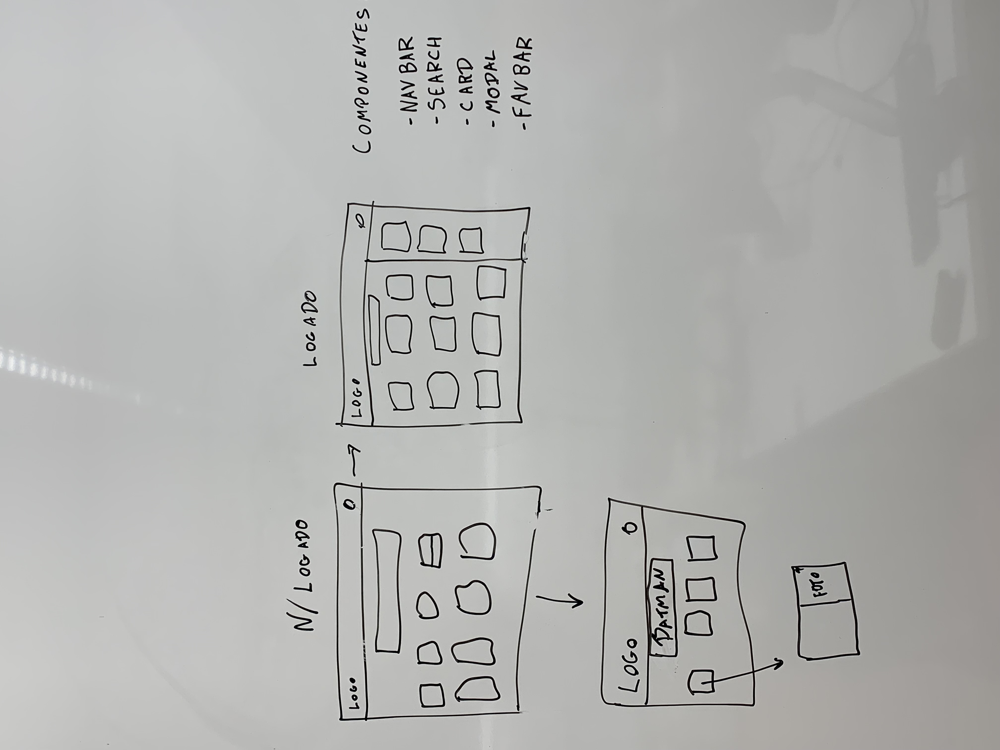

# Mago Games - O mago dos preços baixos

### Sprint 1 (Quinta-feira 18/11)
  * Iniciar o Projeto FrontEnd
  * Testar algumas requisições
 
### Sprint 2 (Terça-feira 23/11)
  * Pesquisar o título de um jogo
  * Filtrar jogos de acordo com o preço
  * Ver informações de um jogo específico
 
### Sprint 3 (Quinta-feira 25/11)
  * Adicionar um jogo a lista de desejos
  * Fazer o Backend

### Sprint 4 (Terça-feira 30/11)
  * Conectar com o BackEnd
  

## Descrição do site:

#### O mago games é um site de consulta dos melhores preços e promoções do mundo dos jogos. Nele é possível ver e pesquisar jogos e suas promoções em uma série de lojas.

## API utilizada:
#### Para o desenvolvimento do Mago Games a seguinte API foi utilizada: 
* https://apidocs.cheapshark.com/ 

## Uso da API no backend:
#### Foram criadas urls no backend para utilizar a API cheapshark por conta de um erro ao tentar realizar as requisições no frontend. Dessa forma, conversamos com a professora Barbara e ela nos indicou essa solução.  

## Acesso ao site:
#### É possível acessar o site na seguinte url:
* https://magogames.herokuapp.com/

## Funcionalidades:
* Na página inicial o usuário consegue ver cards com as melhores ofertas de jogos
* Ao clicar no botão de ver mais em cada card são mostradas mais informações sobre a promoção e o histórico de preços de cada jogo
* O usuário pode pesquisar por jogos específicos e filtrar os anúncios por preço mínimo e máximo
* O usuário pode fazer login e favoritar as ofertas. Assim, ao clicar no botão na navbar uma sidebar é aberta mostrando os favoritos
* O usuário pode se registrar no site com um login e senha, possibilitando que o sistema de favoritos seja liberado. O registro é feito usando bibliotecas de autenticação do Django, dessa forma as informações do registro ficam salvas no banco de dados usando criptografia e um token é gerado para fazer logout (para A+)

## Alunos:
* José Rafael Martins Fernandes
* Lucca Barufatti Velini Sanches
